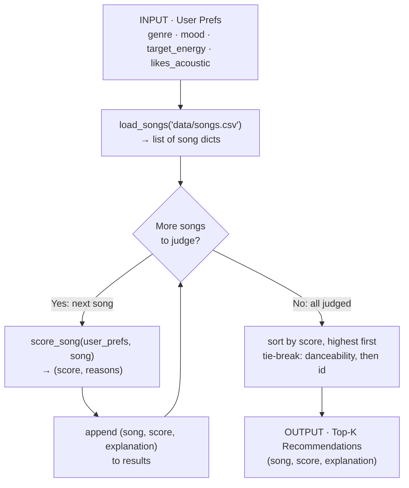

# 🎵 Music Recommender Simulation

## Project Summary

In this project you will build and explain a small music recommender system.

Your goal is to:

- Represent songs and a user "taste profile" as data
- Design a scoring rule that turns that data into recommendations
- Evaluate what your system gets right and wrong
- Reflect on how this mirrors real world AI recommenders

Replace this paragraph with your own summary of what your version does.

---

## How The System Works

Real-world recommenders learn what you like from huge amounts of user
activity and content signals, then predict what you are most likely to enjoy
next. My version keeps that same idea but stays small and transparent: instead
of learning from crowds of users, it compares each song's own attributes
directly against a single user's stated taste. A **Scoring Rule** rates how
closely one song matches the user's preferences, and a **Ranking Rule** scores
every song and returns the best few. My priority is a match that is
correct, explainable, and easy to tune, so I can see exactly why each song was
recommended.

**Features my `Song` uses:**

- `genre` (categorical)
- `mood` (categorical)
- `energy` (numeric)
- `tempo_bpm` (numeric)
- `valence` (numeric)
- `danceability` (numeric)
- `acousticness` (numeric)

**Information my `UserProfile` stores:**

- `favorite_genre`
- `favorite_mood`
- `target_energy`
- `likes_acoustic`

### Data Flow

The user's preferences enter once, the catalog is loaded once, and then **every
song is judged one at a time** before anything is ranked. Scoring is per-song and
independent (a song just earns its own points); ranking is global and happens
once, at the end.



This maps 1:1 onto the three functions in `src/recommender.py`: `load_songs`
(input), `score_song` (the loop body), and `recommend_songs`
(collect → sort → return top-k).

### Algorithm Recipe — "VibeMatch"

Every song starts at **0 points**, earns points for each way it matches the
user's taste, and the highest scores win. Each rule that fires also appends a
plain-English reason, so every score arrives with its receipt.

| Rule | Condition | Points |
| ---- | --------- | ------ |
| **Genre match** | `song.genre == favorite_genre` | **+3.0** |
| **Mood match** | `song.mood == favorite_mood` | **+2.0** |
| **Energy fit** | closeness to `target_energy` | **+2.0 × (1 − \|energy − target_energy\|)** |
| **Acoustic fit** | `likes_acoustic` and `acousticness ≥ 0.6`, **or** not `likes_acoustic` and `acousticness ≤ 0.3` | **+1.0** |
| **Danceability bonus** | `danceability ≥ 0.7` | **+0.5** |

**Total = genre + mood + energy + acoustic + dance** (max ≈ 8.5).

Design choices behind the weights:

- **Genre is king (3.0).** The strongest single signal of taste, so a genre miss
  can't be fully rescued by other matches.
- **Mood (2.0) and energy (2.0) are co-equal seconds.** Energy is *graded, not
  binary* — a 0.75-energy song against a 0.80 target still earns `2.0 × 0.95 =
  1.9`, while a 0.2-energy song earns almost nothing. This keeps the ranking
  meaningful instead of clumping songs at the same score.
- **Acoustic (1.0) and danceability (0.5) are tie-breakers** that nudge between
  otherwise-similar songs rather than driving the ranking.

**Ranking rule:** score every song → sort highest-first → break ties on higher
`danceability`, then lower `id` (deterministic) → return the top `k` (default 5).

### Potential Biases I Expect

- **Genre over-prioritization.** Because genre is weighted highest (3.0), the
  system may bury a song that perfectly matches the user's *mood and energy* just
  because its genre label differs — ignoring great cross-genre matches (e.g. a
  chill jazz track for a user who typed "lofi").
- **Popularity of common labels.** Genres and moods that appear often in the tiny
  catalog have more chances to match; rare genres (classical, reggae, funk) can
  almost never win, so the same handful of songs surface repeatedly.
- **Rigid categorical matching.** Exact-string genre/mood checks mean near-synonyms
  ("indie pop" vs "pop", "chill" vs "relaxed") score zero, penalizing users whose
  taste doesn't use the catalog's exact vocabulary.
- **Feature blind spots.** The score ignores `tempo_bpm` and `valence` entirely, so
  two songs that feel very different (fast vs slow, happy vs sad) can tie — the
  system can't "hear" dimensions it doesn't weigh.

---

## Getting Started

### Setup

1. Create a virtual environment (optional but recommended):

   ```bash
   python -m venv .venv
   source .venv/bin/activate      # Mac or Linux
   .venv\Scripts\activate         # Windows

2. Install dependencies

```bash
pip install -r requirements.txt
```

3. Run the app:

```bash
python -m src.main
```

### Running Tests

Run the starter tests with:

```bash
pytest
```

You can add more tests in `tests/test_recommender.py`.

---

## Sample Recommendation Output

Running `python -m src.main` with the default `genre=pop, mood=happy,
energy=0.8` profile produces:

```text
Loaded songs: 20

Top 5 recommendations for genre=pop, mood=happy, energy=0.8

============================================================
1. Sunrise City — Neon Echo
   Score: 7.46
   Reasons:
     • genre match: pop (+3.0)
     • mood match: happy (+2.0)
     • energy fit: 0.82 vs target 0.8 (+1.96)
     • danceable: 0.79 (+0.5)
============================================================
2. Gym Hero — Max Pulse
   Score: 5.24
   Reasons:
     • genre match: pop (+3.0)
     • energy fit: 0.93 vs target 0.8 (+1.74)
     • danceable: 0.88 (+0.5)
============================================================
3. Rooftop Lights — Indigo Parade
   Score: 4.42
   Reasons:
     • mood match: happy (+2.0)
     • energy fit: 0.76 vs target 0.8 (+1.92)
     • danceable: 0.82 (+0.5)
============================================================
4. Superstition — Stevie Wonder
   Score: 2.46
   Reasons:
     • energy fit: 0.78 vs target 0.8 (+1.96)
     • danceable: 0.8 (+0.5)
============================================================
5. One More Time — Daft Punk
   Score: 2.40
   Reasons:
     • energy fit: 0.85 vs target 0.8 (+1.90)
     • danceable: 0.82 (+0.5)
============================================================
```

**Screenshot or video** *(optional)*: <!-- Insert a screenshot or demo video link here -->

---

## Experiments You Tried

Use this section to document the experiments you ran. For example:

- What happened when you changed the weight on genre from 2.0 to 0.5
- What happened when you added tempo or valence to the score
- How did your system behave for different types of users

---

## Limitations and Risks

Summarize some limitations of your recommender.

Examples:

- It only works on a tiny catalog
- It does not understand lyrics or language
- It might over favor one genre or mood

You will go deeper on this in your model card.

---

## Reflection

Read and complete `model_card.md`:

[**Model Card**](model_card.md)

Write 1 to 2 paragraphs here about what you learned:

- about how recommenders turn data into predictions
- about where bias or unfairness could show up in systems like this
