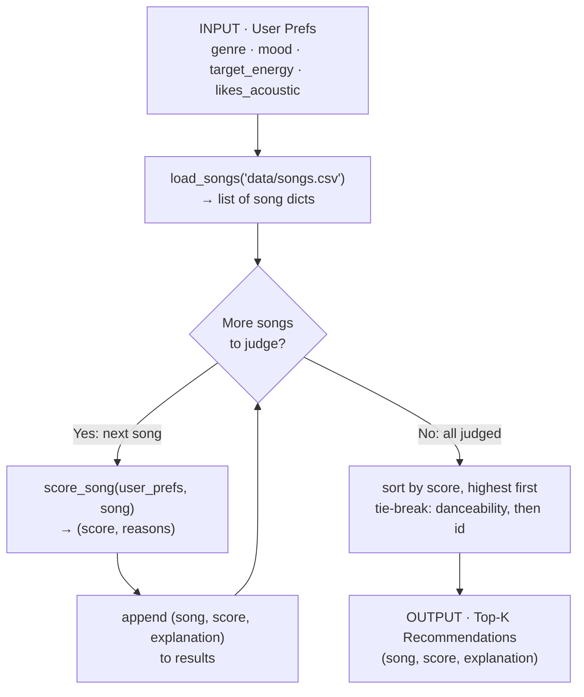

# 🎵 Music Recommender Simulation

## Project Summary

In this project you will build and explain a small music recommender system.

Your goal is to:

- Represent songs and a user "taste profile" as data
- Design a scoring rule that turns that data into recommendations
- Evaluate what your system gets right and wrong
- Reflect on how this mirrors real world AI recommenders

My version, **VibeMatch**, takes a small taste profile — a favorite genre, a
favorite mood, a target energy level, and whether you like acoustic music — and
ranks a 20-song catalog against it. Each song earns points for the ways it
matches your taste (genre, mood, energy fit, acoustic fit, danceability), and the
system returns the top 5 with a plain-English reason for every pick. It doesn't
learn from crowds of users or predict the future; it simply measures, transparently,
how well each song fits the taste you typed in — and it warns you when a profile
is empty, out of range, or self-contradictory instead of hiding the problem.

---

## How The System Works

Real-world recommenders learn what you like from huge amounts of user
activity and content signals, then predict what you are most likely to enjoy
next. My version keeps that same idea but stays small and transparent: instead
of learning from crowds of users, it compares each song's own attributes
directly against a single user's stated taste. A **Scoring Rule** rates how
closely one song matches the user's preferences, and a **Ranking Rule** scores
every song and returns the best few. My priority is a match that is
correct, explainable, and easy to tune, so I can see exactly why each song was
recommended.

**Features my `Song` uses:**

- `genre` (categorical)
- `mood` (categorical)
- `energy` (numeric)
- `tempo_bpm` (numeric)
- `valence` (numeric)
- `danceability` (numeric)
- `acousticness` (numeric)

**Information my `UserProfile` stores:**

- `favorite_genre`
- `favorite_mood`
- `target_energy`
- `likes_acoustic`

### Data Flow

The user's preferences enter once, the catalog is loaded once, and then **every
song is judged one at a time** before anything is ranked. Scoring is per-song and
independent (a song just earns its own points); ranking is global and happens
once, at the end.



This maps 1:1 onto the three functions in `src/recommender.py`: `load_songs`
(input), `score_song` (the loop body), and `recommend_songs`
(collect → sort → return top-k).

### Algorithm Recipe — "VibeMatch"

Every song starts at **0 points**, earns points for each way it matches the
user's taste, and the highest scores win. Each rule that fires also appends a
plain-English reason, so every score arrives with its receipt.

| Rule | Condition | Points |
| ---- | --------- | ------ |
| **Genre match** | `song.genre == favorite_genre` | **+3.0** |
| **Mood match** | `song.mood == favorite_mood` | **+2.0** |
| **Energy fit** | closeness to `target_energy` | **+2.0 × (1 − \|energy − target_energy\|)** |
| **Acoustic fit** | `likes_acoustic` and `acousticness ≥ 0.6`, **or** not `likes_acoustic` and `acousticness ≤ 0.3` | **+1.0** |
| **Danceability bonus** | `danceability ≥ 0.7` | **+0.5** |

**Total = genre + mood + energy + acoustic + dance** (max ≈ 8.5).

Design choices behind the weights:

- **Genre is king (3.0).** The strongest single signal of taste, so a genre miss
  can't be fully rescued by other matches.
- **Mood (2.0) and energy (2.0) are co-equal seconds.** Energy is *graded, not
  binary* — a 0.75-energy song against a 0.80 target still earns `2.0 × 0.95 =
  1.9`, while a 0.2-energy song earns almost nothing. This keeps the ranking
  meaningful instead of clumping songs at the same score.
- **Acoustic (1.0) and danceability (0.5) are tie-breakers** that nudge between
  otherwise-similar songs rather than driving the ranking.

**Ranking rule:** score every song → sort highest-first → break ties on higher
`danceability`, then lower `id` (deterministic) → return the top `k` (default 5).

### Potential Biases I Expect

- **Genre over-prioritization.** Because genre is weighted highest (3.0), the
  system may bury a song that perfectly matches the user's *mood and energy* just
  because its genre label differs — ignoring great cross-genre matches (e.g. a
  chill jazz track for a user who typed "lofi").
- **Popularity of common labels.** Genres and moods that appear often in the tiny
  catalog have more chances to match; rare genres (classical, reggae, funk) can
  almost never win, so the same handful of songs surface repeatedly.
- **Rigid categorical matching.** Exact-string genre/mood checks mean near-synonyms
  ("indie pop" vs "pop", "chill" vs "relaxed") score zero, penalizing users whose
  taste doesn't use the catalog's exact vocabulary.
- **Feature blind spots.** The score ignores `tempo_bpm` and `valence` entirely, so
  two songs that feel very different (fast vs slow, happy vs sad) can tie — the
  system can't "hear" dimensions it doesn't weigh.

---

## Getting Started

### Setup

1. Create a virtual environment (optional but recommended):

   ```bash
   python -m venv .venv
   source .venv/bin/activate      # Mac or Linux
   .venv\Scripts\activate         # Windows

2. Install dependencies

```bash
pip install -r requirements.txt
```

3. Run the app:

```bash
python -m src.main
```

### Running Tests

Run the starter tests with:

```bash
pytest
```

You can add more tests in `tests/test_recommender.py`.

---

## Sample Recommendation Output

Running `python -m src.main` with the default `genre=pop, mood=happy,
energy=0.8` profile produces:

```text
Loaded songs: 20

Top 5 recommendations for genre=pop, mood=happy, energy=0.8

============================================================
1. Sunrise City — Neon Echo
   Score: 7.46
   Reasons:
     • genre match: pop (+3.0)
     • mood match: happy (+2.0)
     • energy fit: 0.82 vs target 0.8 (+1.96)
     • danceable: 0.79 (+0.5)
============================================================
2. Gym Hero — Max Pulse
   Score: 5.24
   Reasons:
     • genre match: pop (+3.0)
     • energy fit: 0.93 vs target 0.8 (+1.74)
     • danceable: 0.88 (+0.5)
============================================================
3. Rooftop Lights — Indigo Parade
   Score: 4.42
   Reasons:
     • mood match: happy (+2.0)
     • energy fit: 0.76 vs target 0.8 (+1.92)
     • danceable: 0.82 (+0.5)
============================================================
4. Superstition — Stevie Wonder
   Score: 2.46
   Reasons:
     • energy fit: 0.78 vs target 0.8 (+1.96)
     • danceable: 0.8 (+0.5)
============================================================
5. One More Time — Daft Punk
   Score: 2.40
   Reasons:
     • energy fit: 0.85 vs target 0.8 (+1.90)
     • danceable: 0.82 (+0.5)
============================================================
```

**Screenshot or video** *(optional)*: <!-- Insert a screenshot or demo video link here -->

---

## Stress Test with Diverse Profiles

To probe the scoring logic, `src/main.py` runs the recommender against six
profiles: three ordinary, well-formed tastes and three **adversarial / edge-case**
profiles designed to see whether the score can be *tricked* or produce
surprising results. Each block below is real terminal output from
`python -m src.main`.

### 1. High-Energy Pop (normal)

`{"genre": "pop", "mood": "happy", "energy": 0.9, "likes_acoustic": False}` — a
textbook profile where every signal points the same way.

```text
######################################################################
# PROFILE: High-Energy Pop
# A textbook profile — everything points the same direction.
# prefs = {'genre': 'pop', 'mood': 'happy', 'energy': 0.9, 'likes_acoustic': False}
######################################################################

Top 5 recommendations

============================================================
1. Sunrise City — Neon Echo
   Score: 8.34
   Reasons:
     • genre match: pop (+3.0)
     • mood match: happy (+2.0)
     • energy fit: 0.82 vs target 0.9 (+1.84)
     • produced fit: acousticness 0.18 (+1.0)
     • danceable: 0.79 (+0.5)
============================================================
2. Gym Hero — Max Pulse
   Score: 6.44
   Reasons:
     • genre match: pop (+3.0)
     • energy fit: 0.93 vs target 0.9 (+1.94)
     • produced fit: acousticness 0.05 (+1.0)
     • danceable: 0.88 (+0.5)
============================================================
3. Rooftop Lights — Indigo Parade
   Score: 4.22
   Reasons:
     • mood match: happy (+2.0)
     • energy fit: 0.76 vs target 0.9 (+1.72)
     • danceable: 0.82 (+0.5)
============================================================
4. Dynamite — BTS
   Score: 3.46
   Reasons:
     • energy fit: 0.88 vs target 0.9 (+1.96)
     • produced fit: acousticness 0.06 (+1.0)
     • danceable: 0.75 (+0.5)
============================================================
5. One More Time — Daft Punk
   Score: 3.40
   Reasons:
     • energy fit: 0.85 vs target 0.9 (+1.90)
     • produced fit: acousticness 0.02 (+1.0)
     • danceable: 0.82 (+0.5)
============================================================
```

**Read:** Behaves exactly as designed — the full-match pop songs run away with
the top two slots, and the tail is filled by high-energy produced tracks.

### 2. Chill Lofi (normal)

`{"genre": "lofi", "mood": "chill", "energy": 0.30, "likes_acoustic": True}` — a
low-energy, acoustic-loving study listener.

```text
######################################################################
# PROFILE: Chill Lofi
# Low energy, acoustic-loving study listener.
# prefs = {'genre': 'lofi', 'mood': 'chill', 'energy': 0.3, 'likes_acoustic': True}
######################################################################

Top 5 recommendations

============================================================
1. Library Rain — Paper Lanterns
   Score: 7.90
   Reasons:
     • genre match: lofi (+3.0)
     • mood match: chill (+2.0)
     • energy fit: 0.35 vs target 0.3 (+1.90)
     • acoustic fit: acousticness 0.86 (+1.0)
============================================================
2. Midnight Coding — LoRoom
   Score: 7.76
   Reasons:
     • genre match: lofi (+3.0)
     • mood match: chill (+2.0)
     • energy fit: 0.42 vs target 0.3 (+1.76)
     • acoustic fit: acousticness 0.71 (+1.0)
============================================================
3. Focus Flow — LoRoom
   Score: 5.80
   Reasons:
     • genre match: lofi (+3.0)
     • energy fit: 0.4 vs target 0.3 (+1.80)
     • acoustic fit: acousticness 0.78 (+1.0)
============================================================
4. Spacewalk Thoughts — Orbit Bloom
   Score: 4.96
   Reasons:
     • mood match: chill (+2.0)
     • energy fit: 0.28 vs target 0.3 (+1.96)
     • acoustic fit: acousticness 0.92 (+1.0)
============================================================
5. Someone Like You — Adele
   Score: 3.00
   Reasons:
     • energy fit: 0.3 vs target 0.3 (+2.00)
     • acoustic fit: acousticness 0.9 (+1.0)
============================================================
```

**Read:** Also clean. Note slot 5: a sad Adele ballad sneaks in purely on a
*perfect* energy match (0.3 vs 0.3 = +2.0) plus the acoustic bonus, despite
sharing neither genre nor mood — an early hint that the numeric terms can
outvote the categorical ones.

### 3. Deep Intense Rock (normal)

`{"genre": "rock", "mood": "intense", "energy": 0.95, "likes_acoustic": False}` —
a high-energy, produced, heavy listener.

```text
######################################################################
# PROFILE: Deep Intense Rock
# High energy, produced (non-acoustic) heavy listener.
# prefs = {'genre': 'rock', 'mood': 'intense', 'energy': 0.95, 'likes_acoustic': False}
######################################################################

Top 5 recommendations

============================================================
1. Storm Runner — Voltline
   Score: 7.92
   Reasons:
     • genre match: rock (+3.0)
     • mood match: intense (+2.0)
     • energy fit: 0.91 vs target 0.95 (+1.92)
     • produced fit: acousticness 0.1 (+1.0)
============================================================
2. Gym Hero — Max Pulse
   Score: 5.46
   Reasons:
     • mood match: intense (+2.0)
     • energy fit: 0.93 vs target 0.95 (+1.96)
     • produced fit: acousticness 0.05 (+1.0)
     • danceable: 0.88 (+0.5)
============================================================
3. Dynamite — BTS
   Score: 3.36
   Reasons:
     • energy fit: 0.88 vs target 0.95 (+1.86)
     • produced fit: acousticness 0.06 (+1.0)
     • danceable: 0.75 (+0.5)
============================================================
4. One More Time — Daft Punk
   Score: 3.30
   Reasons:
     • energy fit: 0.85 vs target 0.95 (+1.80)
     • produced fit: acousticness 0.02 (+1.0)
     • danceable: 0.82 (+0.5)
============================================================
5. Sunrise City — Neon Echo
   Score: 3.24
   Reasons:
     • energy fit: 0.82 vs target 0.95 (+1.74)
     • produced fit: acousticness 0.18 (+1.0)
============================================================
```

**Read:** Only one true rock song exists in the catalog, so after `Storm Runner`
the list is padded with *any* loud, produced track. `Enter Sandman` (metal, the
closest musical cousin) never appears — a direct illustration of the **rigid
categorical matching** bias: "metal" ≠ "rock" earns zero.

### 4. ADVERSARIAL · Conflicting Energy vs Mood

`{"genre": "metal", "mood": "sad", "energy": 0.9, "likes_acoustic": True}` — the
signals deliberately fight each other: **sad** moods are low-energy, yet the user
asks for **0.9 energy**; and they **like acoustic** while requesting **metal**,
the *least* acoustic genre in the catalog.

```text
######################################################################
# PROFILE: ADVERSARIAL · Conflicting Energy vs Mood
# Wants 'sad' mood but 0.9 energy — and 'likes_acoustic' while asking for metal (metal is the least acoustic genre). Every signal fights another.
# prefs = {'genre': 'metal', 'mood': 'sad', 'energy': 0.9, 'likes_acoustic': True}
######################################################################

⚠ CONFLICT: mood 'sad' is typically low-energy, but target energy is 0.9

⚠ CONFLICT: likes_acoustic is set, but genre 'metal' is rarely acoustic

Top 5 recommendations

============================================================
1. Enter Sandman — Metallica
   Score: 4.90
   Reasons:
     • genre match: metal (+3.0)
     • energy fit: 0.95 vs target 0.9 (+1.90)
============================================================
2. Someone Like You — Adele
   Score: 3.80
   Reasons:
     • mood match: sad (+2.0)
     • energy fit: 0.3 vs target 0.9 (+0.80)
     • acoustic fit: acousticness 0.9 (+1.0)
============================================================
3. Dynamite — BTS
   Score: 2.46
   Reasons:
     • energy fit: 0.88 vs target 0.9 (+1.96)
     • danceable: 0.75 (+0.5)
============================================================
4. Gym Hero — Max Pulse
   Score: 2.44
   Reasons:
     • energy fit: 0.93 vs target 0.9 (+1.94)
     • danceable: 0.88 (+0.5)
============================================================
5. One More Time — Daft Punk
   Score: 2.40
   Reasons:
     • energy fit: 0.85 vs target 0.9 (+1.90)
     • danceable: 0.82 (+0.5)
============================================================
```

**Read — the score *is* tricked, and it's revealing:** No single song can
satisfy all four demands, so the ranking splits the user in two. `Enter Sandman`
wins the loud/metal half (genre + energy) while completely ignoring the "sad,
acoustic" request; `Someone Like You` wins the sad/acoustic half while ignoring
the metal/energy request. **The #1 and #2 results are near-opposites of each
other.** Previously the system averaged this contradiction *silently*; it now
**names both conflicts** up front (see the `⚠ CONFLICT` lines) so the user knows
the ranking is a compromise between demands that fight each other, not a clean
match. *(Fixed — see [Fixes Applied](#fixes-applied-from-the-stress-test).)*

### 5. EDGE CASE · Empty Profile

`{}` — the user stated no preferences at all.

```text
######################################################################
# PROFILE: EDGE CASE · Empty Profile
# User stated no preferences at all. No scoring rule can fire, so the ranking collapses onto the tie-breakers (danceability, then id).
# prefs = {}
######################################################################

⚠ EMPTY PROFILE: no genre/mood/energy/acoustic preference given.
  Nothing to match on — results below are ordered by danceability
  only, NOT by how well they fit you.

Top 5 recommendations

============================================================
1. HUMBLE. — Kendrick Lamar
   Score: 0.50
   Reasons:
     • danceable: 0.9 (+0.5)
============================================================
2. Gym Hero — Max Pulse
   Score: 0.50
   Reasons:
     • danceable: 0.88 (+0.5)
============================================================
3. Rooftop Lights — Indigo Parade
   Score: 0.50
   Reasons:
     • danceable: 0.82 (+0.5)
============================================================
4. One More Time — Daft Punk
   Score: 0.50
   Reasons:
     • danceable: 0.82 (+0.5)
============================================================
5. Superstition — Stevie Wonder
   Score: 0.50
   Reasons:
     • danceable: 0.8 (+0.5)
============================================================
```

**Read:** No crash — the code degrades gracefully because every rule is guarded
with `.get()` / `in` checks. But with all preference rules dead, the ranking
**collapses onto the danceability tie-breaker**: everyone scores exactly `0.50`
and the order is decided entirely by `danceability` (then `id`). A "no
information" user gets a *danceability chart*, not a neutral or random sample.
That default is no longer *hidden*: an `⚠ EMPTY PROFILE` banner now states
outright that nothing was matched on and the order is danceability-only.
*(Fixed — see [Fixes Applied](#fixes-applied-from-the-stress-test).)*

### 6. EDGE CASE · Out-of-Range Energy

`{"genre": "pop", "mood": "happy", "energy": 2.0, ...}` — `energy = 2.0` is
outside the valid `0–1` range. Because the energy term is `2.0 × (1 − |energy −
target|)` with no clamping, the closeness factor goes **negative**.

```text
######################################################################
# PROFILE: EDGE CASE · Out-of-Range Energy
# energy = 2.0 is outside the valid 0–1 range. The graded energy term goes NEGATIVE, so this profile can actively push songs down the list.
# prefs = {'genre': 'pop', 'mood': 'happy', 'energy': 2.0, 'likes_acoustic': False}
######################################################################

⚠ CONFLICT: energy 2.0 is outside 0.0–1.0 and was clamped to 1.0

Top 5 recommendations

============================================================
1. Sunrise City — Neon Echo
   Score: 8.14
   Reasons:
     • genre match: pop (+3.0)
     • mood match: happy (+2.0)
     • energy fit: 0.82 vs target 1.0 (+1.64)
     • produced fit: acousticness 0.18 (+1.0)
     • danceable: 0.79 (+0.5)
============================================================
2. Gym Hero — Max Pulse
   Score: 6.36
   Reasons:
     • genre match: pop (+3.0)
     • energy fit: 0.93 vs target 1.0 (+1.86)
     • produced fit: acousticness 0.05 (+1.0)
     • danceable: 0.88 (+0.5)
============================================================
3. Rooftop Lights — Indigo Parade
   Score: 4.02
   Reasons:
     • mood match: happy (+2.0)
     • energy fit: 0.76 vs target 1.0 (+1.52)
     • danceable: 0.82 (+0.5)
============================================================
4. Dynamite — BTS
   Score: 3.26
   Reasons:
     • energy fit: 0.88 vs target 1.0 (+1.76)
     • produced fit: acousticness 0.06 (+1.0)
     • danceable: 0.75 (+0.5)
============================================================
5. One More Time — Daft Punk
   Score: 3.20
   Reasons:
     • energy fit: 0.85 vs target 1.0 (+1.70)
     • produced fit: acousticness 0.02 (+1.0)
     • danceable: 0.82 (+0.5)
============================================================
```

**Read — the bug is now fixed:** *Before the fix,* `energy fit` contributed
**negative** points (`0.82 vs target 2.0 (-0.36)`), which the recipe never
intended — energy was meant to *add* `0.0–2.0`, never subtract — so a malformed
input silently penalized every song. Now the target is **clamped to `1.0`**
before scoring (announced by the `⚠ CONFLICT` line), every `energy fit` term is
back in its designed non-negative range, and scores rise accordingly (e.g.
`Sunrise City` `6.14 → 8.14`). The clamp lives in `score_song`, so the fix holds
for *any* caller, not just this CLI. *(See [Fixes Applied](#fixes-applied-from-the-stress-test).)*

### What the stress test taught me

| Profile | Tricked? | What it exposed | Status |
| ------- | -------- | --------------- | ------ |
| High-Energy Pop | No | Baseline: full matches dominate as designed. | — |
| Chill Lofi | No | Numeric energy match alone can float a genre/mood mismatch into the top 5. | Known trade-off |
| Deep Intense Rock | Mildly | Rigid categorical matching — "metal" never substitutes for "rock". | Documented limitation |
| Conflicting Energy vs Mood | **Yes** | Contradictions were silently averaged; #1 and #2 are opposites, neither fully matches. | ✅ **Fixed** (warns) |
| Empty Profile | Edge | Graceful (no crash) but collapsed to a *hidden* danceability default. | ✅ **Fixed** (banner) |
| Out-of-Range Energy | **Yes** | Unclamped energy term went negative — a real bug the normal profiles never reveal. | ✅ **Fixed** (clamp) |

### Fixes Applied from the Stress Test

The three problems the adversarial profiles surfaced are now fixed **in
`src/recommender.py`** (so every caller benefits, not just the CLI), with the
CLI in `src/main.py` surfacing the new signals:

1. **Out-of-range energy → negative points (a correctness bug).**
   `score_song` now clamps the energy target to `[0, 1]` *and* clamps the
   `closeness` factor to `[0, 1]`, so the energy term can never leave its
   designed `0.0–2.0` range. A malformed `energy=2.0` degrades to "capped at
   1.0" instead of silently *subtracting* points.

2. **Silently averaged contradictions.** A new `detect_conflicts(user_prefs)`
   returns plain-English warnings when the profile fights itself — energy vs.
   mood (e.g. `sad` + `0.9`), `likes_acoustic` vs. a rarely-acoustic genre, or an
   out-of-range value. The recommender still answers, but the CLI prints each
   `⚠ CONFLICT` so the compromise is never mistaken for a clean match.

3. **Hidden empty-profile default.** A new `profile_is_empty(user_prefs)` flags a
   profile with no usable signal; the CLI prints an `⚠ EMPTY PROFILE` banner
   making it explicit that results are ordered by danceability only, not by fit.

All changes are **transparent and additive** — no existing reason strings were
removed, the weight recipe is unchanged, and `pytest` still passes (`2 passed`).
Note that **rigid categorical matching** (Deep Intense Rock) is left *documented
but unfixed* on purpose: softening genre/mood into partial-credit similarity
would change the core scoring recipe and every score above, so it belongs in a
deliberate v2, not a bug-fix pass.

---

## Experiments You Tried

- **Six-profile stress test.** My main experiment was running the recommender
  against six user profiles at once (three normal, three adversarial) and reading
  the top-5 list each produced. This is documented in full above under
  [Stress Test with Diverse Profiles](#stress-test-with-diverse-profiles),
  including all 15 pairwise comparisons in the model card.
- **Watching one song travel across profiles.** The most striking result was that
  *Gym Hero* — an intense workout track — landed in the top 5 of **five of the six
  profiles**. This experiment revealed the "high-energy filter bubble": the
  always-on energy and danceability points let a few loud, danceable songs surface
  for almost everyone, regardless of whether genre or mood matched.
- **Feeding the system broken input on purpose.** I tried an empty profile (`{}`),
  an out-of-range `energy=2.0`, and a self-contradictory profile
  (`metal` + `sad` + high energy). These exposed three real problems — a
  danceability-only fallback, a negative-scoring math bug, and silently averaged
  contradictions — which I then **fixed** (see
  [Fixes Applied](#fixes-applied-from-the-stress-test)).
- **Energy as a graded vs. binary signal.** Making energy a *graded* term
  (`2.0 × closeness`) instead of a yes/no match is what keeps the ranking from
  clumping songs at the same score — a near-miss on energy still earns most of the
  points, so ties are rare and the order stays meaningful.

---

## Limitations and Risks

- **Tiny catalog.** Only 20 songs, with 17 genres spread across them — most genres
  have a single example, so the same handful of songs surface again and again.
- **High-energy filter bubble.** The energy and danceability points are awarded
  even when genre and mood miss, so loud, danceable tracks crowd into nearly every
  active user's list while quiet, acoustic songs get pushed down.
- **Rigid categorical matching.** Genre and mood are matched by exact string, so
  near-neighbors like "metal" vs "rock" or "indie pop" vs "pop" score zero.
- **No understanding of the music itself.** It knows nothing about lyrics,
  language, melody, or culture — only the handful of numeric tags in the CSV. It
  also ignores `tempo_bpm` and `valence` entirely.
- **Not for real use.** A low score means "this small catalog doesn't fit," not
  "your taste is wrong." This is a classroom tool, not a product.

I go deeper on these — with examples and the plain-language "Gym Hero" walkthrough
— in the [model card](model_card.md).

---

## Reflection

Read and complete `model_card.md`:

[**Model Card**](model_card.md)

The biggest thing this project taught me is that it is amazing how much data you
need to collect to make these suggestion algorithms as accurate as possible.
Working with only 20 songs, I could immediately feel the ceiling: the same few
tracks kept winning, whole genres had a single example, and there simply wasn't
enough information for the system to tell subtle tastes apart. My biggest
learning moment was watching one gym song, *Gym Hero*, surface for almost every
user I tested. That single result made the whole idea click — a recommendation
is really just points and sorting, and a couple of strong signals like energy
and danceability can quietly crowd out everything else. It showed me that when
real apps all seem to suggest the same popular songs, it is probably not a bug
but a side effect of how their scoring is weighted, and that better accuracy
mostly comes from feeding the model far more and far richer data than I had here.

Using AI tools sped up the parts that would have slowed me down the most —
scaffolding the scoring functions, generating the diverse test profiles, and
turning messy terminal output into clean explanations. Where I had to slow down
and double-check was anywhere the numbers actually mattered: I verified the point
math by hand, caught an energy calculation that could go negative on bad input,
and confirmed the genre counts myself instead of trusting a summary. The AI was a
great accelerator, but I still had to be the one who decided whether the output
was correct. What surprised me most was how convincing a simple, rule-based
system can feel — even with just five plain "if" rules and no learning at all,
the ranked lists genuinely read like real recommendations, which made me
appreciate both how little it takes to *seem* smart and how easily that
appearance can hide a bias. If I extended this project, I would start by
collecting a much larger and more balanced catalog, then teach the system that
similar genres and moods are related instead of strangers, and finally add a
rule that keeps the top five varied so a handful of loud, danceable songs can't
dominate everyone's results.
