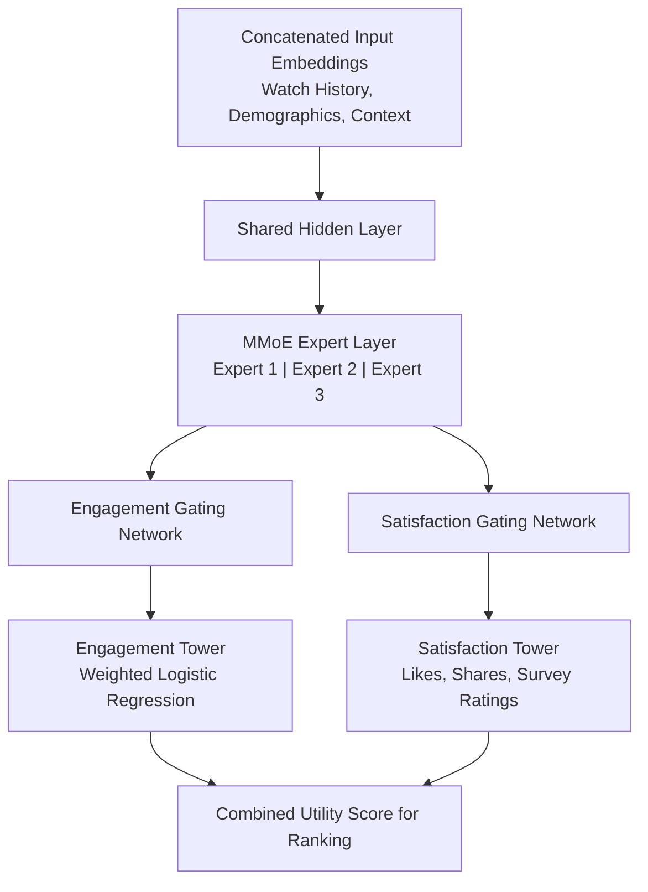

# Technical Architectures and Mathematical Paradigms Governing Algorithmic Recommendations in Modern Streaming Ecosystems

The rise of digital media consumption is defined by a primary challenge: how to connect users with relevant content within catalogs containing millions of items. Major streaming platforms, most notably Spotify and YouTube, have moved beyond basic index searches and static catalogs to build highly personalized recommender systems. These systems combine multi-stage deep learning pipelines, hybrid filtering frameworks, and real-time online learning algorithms to map human taste and deliver content.

An analysis of these platforms shows a shared business goal: maximizing user retention, platform engagement, and stream time, while addressing the data-sparsity and cold-start problems inherent in massive content marketplaces. This report details the technical mechanisms, mathematical foundations, and system designs that enable these streaming platforms to predict what users will want to watch or listen to next.

## YouTube: Multi-Stage Video Recommendation

YouTube’s recommendation system operates within highly demanding engineering constraints, managing a corpus of billions of videos for a global user base. To process massive amounts of data in real time, the platform splits its recommendation task into a two-stage information retrieval funnel: candidate generation and ranking. This architecture balances candidate retrieval speed with downstream scoring precision.

| Architectural Stage | Input Scale | Computational Focus | Key Modeling Methods | Primary Optimization Objective |
| --- | --- | --- | --- | --- |
| Candidate Generation (Retrieval) [cite: 5, 8] | Billions of videos | Sub-millisecond retrieval across the global corpus | Extreme multiclass classification; Continuous Bag-of-Words (CBOW) embeddings; Approximate Nearest Neighbor (ANN) search | High-recall selection of a few hundred relevant candidates |
| Ranking (Scoring) [cite: 5, 8] | Hundreds of candidate videos | Deep evaluation of user-item feature interactions | Multi-gate Mixture-of-Experts (MMoE); Weighted Logistic Regression; Wide & Deep learning models | Expected watch time per impression; multi-objective engagement and satisfaction metrics |

### Candidate Generation (Retrieval)

The candidate generation phase acts as an aggressive filter, reducing YouTube's video catalog to a few hundred candidates. This stage is modeled as an extreme multiclass classification problem. The system attempts to predict the specific video watch event $w_t$ at time $t$ from a catalog of millions of videos $V$, based on a user’s historical context $U$ and current environment $C$.

$$
P(w_t = i \mid U, C) = \frac{e^{v_i \cdot u}}{\sum_{j \in V} e^{v_j \cdot u}}
$$

where $u \in \mathbb{R}^D$ is the dense representation of the user-context pair, and $v_i \in \mathbb{R}^D$ represents the target video embedding vector.

The input to this neural network is a concatenated vector of diverse embeddings. It incorporates the user's historical watch sequence, search query tokens, and demographic features including age, gender, geographic origin, and logged-in status.

To train this model on a catalog of millions of videos, YouTube uses candidate sampling during training. This calculates the loss over a set of sampled negative classes and corrects for the bias using importance weighting.

At inference time, the expensive softmax evaluation is bypassed. Because the probability is monotonic with respect to the dot product $v_i \cdot u$, the scoring problem is reduced to a maximum inner product search in the latent space. This search is executed in sub-millisecond timeframes using locality-sensitive hashing or hierarchical tree indexes.

The system prioritizes recent watch history over older interactions, capturing immediate user interests while maintaining broad, long-term contextual profiles.

### Deep Ranking

Once a few hundred candidate videos are retrieved, the ranking network applies a precise, feature-rich scoring model to determine the exact sequence presented to the user. While candidate generation looks broadly across the catalog, the ranking network has the computational budget to evaluate complex feature interactions. This includes historical impression data and co-occurrence relationships.

Rather than optimizing solely for Click-Through Rate (CTR), which often promotes clickbait that users quickly abandon, YouTube structured its ranking network to predict expected watch time per impression. To train a model that predicts continuous watch time using a classification loss, the system utilizes Weighted Logistic Regression (WLR).

During training, positive examples are weighted by the actual watch time $T$ observed on that video, while negative examples receive a unit weight of $1$. Under cross-entropy loss, assuming the overall click-through rate $P$ is small, the learned odds of the model approximate expected watch time:

$$
\text{Odds} = \frac{\sum T}{\text{Impressions} - \text{Clicks}} \approx E[T](1 + P) \approx E[T]
$$

By serving recommendations based on the exponential activation function of the final linear layer of this network, YouTube directly ranks candidates according to expected watch time.

### Multi-Task Ranking and Bias Mitigation (MMoE Framework)

Relying solely on watch time can favor longer, lower-quality videos over shorter, highly satisfying ones. Modern systems solve this by formulating ranking as a multi-task learning problem, optimizing for both user engagement and user satisfaction.

To handle these distinct and often conflicting optimization paths, platforms deploy the Multi-gate Mixture-of-Experts (MMoE) neural network architecture.

The MMoE layer consists of parallel feed-forward sub-networks that learn to specialize in representing different subspaces of the user-item interaction. Each target task is assigned its own gating network, which computes a probability distribution over the experts. This allows each task to selectively weight the representations most useful for its specific objective.

To address position bias, the tendency for users to click on the first video in a list regardless of its relevance, YouTube integrates a Wide & Deep framework alongside its ranking network. A shallow tower is introduced during training that takes bias features such as the position order and the device-specific screen size as direct inputs. The main neural network handles the core user-item compatibility features.

The outputs of both the bias tower and the main tower are combined prior to the final prediction layer. During online serving, when the goal is to evaluate pure user satisfaction without position-based distortion, the bias tower is omitted from the inference graph, ensuring unbiased recommendations.

As these multi-task models grow larger and more complex, they become increasingly susceptible to training instability issues such as loss divergence. Production systems mitigate this through specialized optimization algorithms and gradient-clipping techniques designed to stabilize multi-gate parameters during large-scale training runs.

## Collaborative Filtering vs. Content-Based Filtering

At the heart of any recommender system lies the choice between two foundational philosophies: Collaborative Filtering (CF) and Content-Based Filtering (CBF). Modern streaming platforms do not rely on either in isolation; rather, they deploy hybrid frameworks that exploit the complementary strengths of both approaches.

| Dimension | Collaborative Filtering (CF) | Content-Based Filtering (CBF) |
| --- | --- | --- |
| Primary Data Source | User-item interaction logs (clicks, streams, skips, ratings). | Intrinsic item attributes (audio features, video tags, transcripts, lyrics). |
| Mathematical Core | Matrix factorization, cosine similarity, latent factor projection. | Feature vector extraction, cosine similarity in attribute space, classification models. |
| Cold-Start Viability | Severe failure: cannot recommend new items with zero interactions. | Excellent: can instantly represent and recommend newly uploaded tracks or videos. |
| Vulnerability to Feedback Loops | High: tends to reinforce popular items, creating superstar effects and echo chambers. | Low: recommends based on niche acoustic or visual profiles, regardless of popularity. |
| Platform Discovery Depth | Promotes serendipity by bridging unexpected genres through shared user behavior. | Restricted to similar-sounding or looking content; limits broad genre-hopping. |
| Computation Complexity | High scaling complexity as users ($U$) and items ($I$) grow; requires matrix decomposition. | Linear with respect to the number of active items; easily parallelizable via vector search. |
| Key Metrics Tracked | Playlist co-occurrences, repeat plays, skip rates. | Spectrograms, tempo, key, lyrics embeddings, visual tags. |

### Collaborative Filtering (CF)

Collaborative filtering relies on the shared behaviors of the user community. Its fundamental premise is that if User A and User B share a highly overlapping historical consumption pattern, the items preferred by User A that remain unseen by User B are excellent candidates for User B's recommendations.

In modern industrial streaming systems, where explicit rating data is sparse, platforms rely heavily on implicit feedback: unobtrusive observations of user actions such as stream counts, play duration, and skip events.

The standard approach for implicit collaborative filtering, formulated by Hu, Koren, and Volinsky, maps user $u$ and item $i$ interactions by decomposing a user-item matrix using Alternating Least Squares (ALS). We define a binary preference variable $p_{ui}$ indicating whether a user has a baseline interest in an item:

$$
p_{ui} = \begin{cases}
1 & \text{if } r_{ui} > 0 \\
0 & \text{if } r_{ui} = 0
\end{cases}
$$

where $r_{ui}$ is the observed implicit interaction metric such as total stream count or watch time.

Because implicit signals are noisy, a single play does not guarantee love, nor does a zero count guarantee dislike, we introduce a confidence parameter $c_{ui}$ that scales with interaction frequency:

$$c_{ui} = 1 + \alpha r_{ui}$$

Here, $\alpha$ is a tuning hyperparameter that controls the rate at which confidence increases alongside user interactions.

The objective of matrix factorization is to learn a low-dimensional user latent factor vector $x_u \in \mathbb{R}^K$ and an item latent factor vector $y_i \in \mathbb{R}^K$ such that their inner product approximates the binary preference $p_{ui}$, weighted by the confidence $c_{ui}$. This is achieved by minimizing the following cost function over all users and items, containing an $L_2$ regularization term to prevent overfitting:

$$
\mathcal{L}_{ALS} = \sum_{u, i} c_{ui} \left( p_{ui} - x_u^T y_i \right)^2 + \lambda \left( \sum_{u} \Vert x_u \Vert^2 + \sum_{i} \Vert y_i \Vert^2 \right)
$$

where $\lambda$ is the regularization penalty.

Because the term $x_u^T y_i$ couples the parameters, the loss function is non-convex. The Alternating Least Squares (ALS) algorithm resolves this by alternating between holding the item vectors $Y$ constant and solving for the user vectors $X$, and vice versa. When fixing the item matrix $Y \in \mathbb{R}^{M \times K}$, the optimal user vector $x_u$ is solved analytically via a ridge regression step:

$$
x_u = \left( Y^T C^u Y + \lambda I \right)^{-1} Y^T C^u p_u
$$

where $C^u \in \mathbb{R}^{M \times M}$ is a diagonal matrix containing the confidence values $c_{ui}$ for all items associated with user $u$, $I$ is the identity matrix, and $p_u \in \mathbb{R}^M$ is the preference vector for the user. Symmetrically, when fixing the user matrix $X \in \mathbb{R}^{N \times K}$, the optimal item vector $y_i$ is computed as:

$$
y_i = \left( X^T C^i X + \lambda I \right)^{-1} X^T C^i p_i
$$

While increasing the number of latent factors $K$ boosts prediction accuracy, it raises the computational cost of matrix inversion to $O(K^3)$.

To optimize performance, platforms can use the Sherman-Morrison Formula (SMF) to speed up updates of the inverse covariance matrix, reducing the theoretical complexity to $O(K\vert R \vert)$. However, in production environments with high average ratings per user, direct calculation may still become a bottleneck, leading engineers to deploy approximate matrix inversion or parallelized ALS variations on distributed clusters.

Despite its power, collaborative filtering is limited by the item cold-start problem: a newly uploaded song or video cannot be recommended via CF because it has zero user interactions.

### Content-Based Filtering (CBF)

Content-based filtering bypasses community behavior, focusing entirely on the intrinsic attributes of the items and their alignment with a user's explicit or implicit history.

Instead of looking for user overlaps, CBF constructs detailed item feature vectors based on audio spectrograms, video transcripts, metadata tags, and textual descriptions. These attributes are matched against the user's historical preferences using vector similarity metrics.

CBF excels at surface discovery and recommending niche, newly released, or low-popularity items. However, it can restrict recommendation diversity, creating a filter bubble where users are only recommended variations of content they have already consumed.

To construct a robust personalization engine, modern platforms deploy hybrid architectures. The collaborative filtering layer maps the broad, multi-dimensional connections between users and items. Meanwhile, the content-based filtering layer enriches this mapping by analyzing item attributes, solving the cold-start problem and ensuring that recommendations are contextually aligned and sonically or visually consistent.

## Spotify: Hybrid Audio Personalization

The core of Spotify’s recommendation engine is a hybrid pipeline that combines collaborative filtering, raw audio signal analysis, and natural language processing to generate personalized playlists like Discover Weekly and Release Radar. This system represents a significant evolution from the platform's early years, when it relied primarily on collaborative filtering before acquiring machine learning and audio analysis expertise through The Echo Nest.

| Feature Layer | Source Mechanism | Data Format | Mathematical / Model Framework | Operational Impact |
| --- | --- | --- | --- | --- |
| Acoustic Profiling [cite: 1, 2] | Raw audio file ingestion and digital signal processing | Spectrogram slices; acoustic vectors | Convolutional Neural Networks (CNNs); 42-dimensional feature embedding vectors | Bypasses item cold-start; maps structural transitions and timbral features |
| Organizational CF [cite: 12, 27, 34] | User-created playlists and listening session co-occurrences | Playlist sequence logs | Continuous Bag-of-Words (CBOW) Word2Vec; Factored Item Similarity Model (FISM) | Maps contextual relationships and acoustic flow |
| Cultural Semantic Extraction [cite: 3, 27] | Text scraping from music blogs, social media, and metadata | Raw web text; lyrics; artist bios | Large Language Models (LLMs); TF-IDF / Adjective Vector embeddings | Captures genre trends, cultural context, and emotional nuance |
| Real-Time Context Logging [cite: 28] | Live sensor and app environment polling | Geolocation, local weather, time-stamps | Dynamic Context-Aware Filtering | Adjusts recommendations to suit the time of day, location, and environment |

### Sourced Metadata and Acoustic Profiling (CBF)

Upon track ingestion, the platform analyzes the file's acoustic properties. Using deep neural networks, Spotify calculates high-level perceptual attributes such as acousticness, energy, danceability, and valence, and performs detailed temporal slicing. This segments the audio file from major structural sections, separating verses, choruses, and solos, down to tatums, the smallest cognitively meaningful subdivisions of the main beat.

These acoustic features are projected into a high-dimensional vector space, for example a 42-dimensional vector in research contexts, enabling the system to evaluate song similarity based on raw sound properties, completely independent of user interaction data.

### Playlist-Centric Collaborative Filtering and Word2Vec Adaptations

To capture the social and contextual relationships between songs, Spotify treats user-curated playlists as cohesive documents and the tracks within them as words in a sequence. Using Google's Word2Vec, specifically the Continuous Bag-of-Words model with negative sampling, the platform learns static embeddings where the geometric distance between tracks reflects their playlist co-occurrence patterns.

However, pure Word2Vec modeling is subject to limitations: its sliding window parameters can break correlations between tracks positioned far apart in large playlists. In practice, platforms compare Word2Vec with models like the Factored Item Similarity Model (FISM), which is effective at learning item representations even with highly sparse interaction data, such as obscure tracks in niche playlists.

To capture even more complex structures, advanced engines deploy multi-task graph-based inductive representation models such as MUSIG. These models combine multiple supervision tasks including genre prediction, raw acoustic similarity, and playlist co-occurrence graphs to generate robust track representations.

At runtime, Spotify utilizes Annoy (Approximate Nearest Neighbors Oh Yeah) trees. This library uses locality-sensitive hashing and random projection techniques to partition the high-dimensional vector space, allowing the system to execute rapid nearest-neighbor queries across millions of tracks.

### Cultural Semantic Extraction (NLP and LLMs)

To align musical recommendations with cultural trends, the system leverages Natural Language Processing (NLP) and Large Language Models (LLMs). The platform continuously crawls online music blogs, reviews, social platforms, and user playlist titles.

By vectorizing descriptive terms and adjectives associated with artists and tracks, the model maps the language people use to describe music. This semantic layer allows the algorithm to understand contextual concepts, cultural trends, and emotional tones, grouping tracks under themes like introspective folk or high-energy workout pop.

### Context-Aware Modeling and User Taste Clusters

Spotify does not treat user profiles as single, static vectors. Instead, it maps users across distinct, multi-interest taste clusters. A user may prefer classical music on Monday mornings, motivation hip-hop during Tuesday afternoon workouts, and indie-rock on weekends.

The system leverages contextual parameters such as the time of day, geolocation, and even local weather conditions to dynamically adjust recommendations.

To maintain these profiles, the platform categorizes user feedback into two distinct streams:

- Explicit feedback: direct actions including saving a track to a library, manually adding a song to a playlist, sharing a track, or explicitly following an artist.
- Implicit feedback: silent interactions, most notably listening-session length, repeat plays, and skip rates.

Within this feedback framework, the platform enforces the 30-second rule. If a user listens to a song for more than 30 seconds, it triggers a positive feedback signal, updating the user's taste cluster and marking the track as a successful stream for monetization. Conversely, immediate skips before the 30-second mark generate a negative signal, lowering the track's priority in future sessions.

However, skips are weighted contextually: a skip during an active search or exploratory session is expected, whereas a skip during a passive, focused listening session such as in a study playlist is treated as a strong indicator of dissatisfaction.

### The Core of the Algorithm: BART

To balance these features, Spotify deploys an artificial intelligence system called BART (Bandits for Recommendations as Treatments). BART is designed to keep users engaged by switching between two operational modes:

- Exploitation: recommending familiar tracks or artists aligned with the user's established history to ensure immediate satisfaction and comfort.
- Exploration: introducing novel, unfamiliar tracks to actively test and expand the user's taste profile.

BART treats exploration as an experiment. By injecting new tracks into personalized playlists, the system gathers unbiased feedback on user preferences. If the user engages positively, the taste cluster is expanded; if they skip, the system adjusts its boundaries to maintain an optimal balance of discovery and familiarity.

## Real-Time Personalization Through Online Learning

While deep neural networks excel at processing massive datasets offline, they are less suited for making real-time, context-specific decisions where user feedback must be integrated immediately. To achieve this level of hyper-personalization, streaming platforms deploy reinforcement learning frameworks, specifically contextual multi-armed bandits.

### Visual Personalization: The Netflix Approach

A prominent application of contextual bandits is Netflix’s dynamic personalization of title artwork. While traditional recommendation systems focus on selecting which titles to display, Netflix uses contextual bandits to customize how those titles are visually presented on the home screen.

The creative pipeline generates a pool of dozens of candidate images, or arms, for a single title, designed to highlight different themes:

- Romantic focus: highlighting a romantic subplot or lead actors in an intimate setting.
- Action focus: showcasing a high-intensity stunt or explosion.
- Cast focus: featuring a prominent, recognizable actor.

### Mathematical Framework: LinUCB

To select the optimal image for each user, the system utilizes linear contextual bandit algorithms like LinUCB. The algorithm operates on the assumption that the expected payoff, for example a play event, of an action $a$ given a context vector $x$ is linear:

$$
E[r_{t,a} \mid x_{t,a}] = x_{t,a}^T \theta_a^*
$$

where $\theta_a^*$ is an unknown coefficient vector corresponding to arm $a$, which must be learned dynamically.

The context vector $x$ captures a multidimensional representation of the user's state, including viewing history, explicit preferences, language, device constraints, and temporal variables.

To balance exploration and exploitation, LinUCB calculates a score for each candidate arm $a$ by adding a standard deviation boundary to the expected reward:

$$
\text{Score}_a = x^T \theta_a + \alpha \sqrt{x^T A_a^{-1} x}
$$

where $A_a$ represents the covariance matrix of the historical context vectors where arm $a$ was chosen, $\theta_a$ is the ridge-regression estimate of the coefficient vector, and $\alpha$ is a hyperparameter that controls the exploration rate.

The standard deviation term $\sqrt{x^T A_a^{-1} x}$ represents the model's uncertainty. If an image has been shown frequently in similar contexts, its variance shrinks, and its score is dominated by the exploited expected value $x^T \theta_a$. If an image has rarely been shown, its variance is large, causing the upper confidence bound to swell. By selecting the arm that maximizes this score, the platform balances optimized exploration with immediate user engagement, preventing the model from locking onto sub-optimal images.

To ensure an unbiased training dataset, platforms run an exploration bucket, where a small fraction of traffic is presented with randomly selected images. This unpersonalized interaction data is logged to continuously train and update the bandit model.

### LLM Integration and Reasoning Distillation

Modern personalization engines have begun integrating Large Language Models (LLMs) to refine contextual bandits. While traditional bandits rely on purely numeric vectors, they can struggle to capture complex semantic connections.

To address this, modern frameworks deploy post-trained models such as Llama-based architectures to reason over text representations. The system translates a user’s viewing history into a descriptive text narrative and pairs it with visual descriptions of the artwork generated by Vision-Language Models (VLMs). The LLM analyzes these descriptions to evaluate compatibility, for example matching a user who prefers period dramas with strong female leads with an image described as a somber portrait of a queen. In offline evaluations, this semantic reasoning layer has demonstrated significant engagement improvements over classical numeric-vector bandits.

## Synthesized Strategic Outlook and Industry Recommendations

The architectural designs of YouTube, Spotify, and Netflix demonstrate that predicting user preference requires a multi-stage approach. As streaming platforms continue to scale, several technical priorities emerge for recommendation system design:

- Multi-modal representation alignment: recommender systems should move beyond isolated data pipelines to represent raw audio signals, video frames, text descriptions, and behavioral logs in a single, unified vector space. This integration ensures that newly uploaded or niche content is represented accurately, solving the cold-start problem.
- Explicit multi-objective optimization: systems should avoid optimizing for single, narrow metrics like CTR or watch time. Utilizing architectures like MMoE allows platforms to balance user engagement with satisfaction, creating healthier recommendation loops and improving long-term retention.
- Active bias correction: training models on raw interaction logs can reinforce existing biases, such as position bias. Recommender pipelines must include explicit bias-correction layers, such as Wide & Deep shallow towers, to separate presentation effects from true user preferences.
- Controlled exploration via reinforcement learning: to prevent recommendation monotony, architectures should incorporate active exploration frameworks like contextual bandits. These algorithms dynamically test new content and gather unbiased feedback, expanding the system's mapping of user taste.

By combining collaborative filtering with content-based features and real-time reinforcement learning, streaming platforms can build recommendation engines that do not just predict what a user will love next; they help users discover new dimensions of their own taste.
